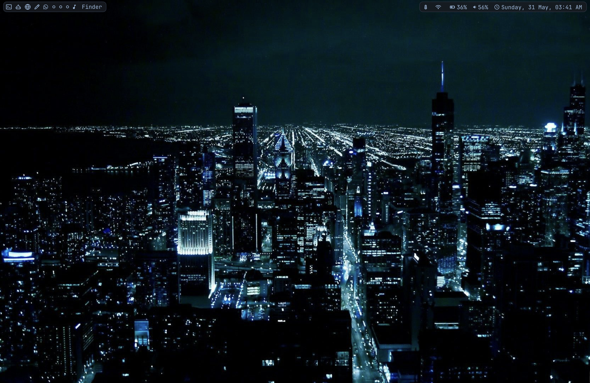
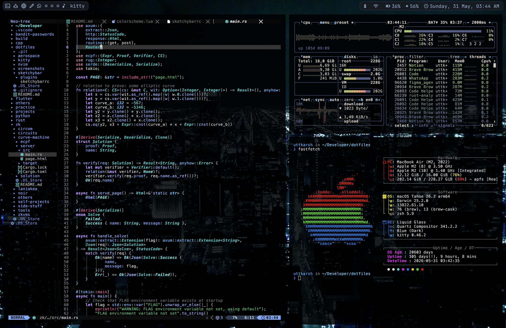
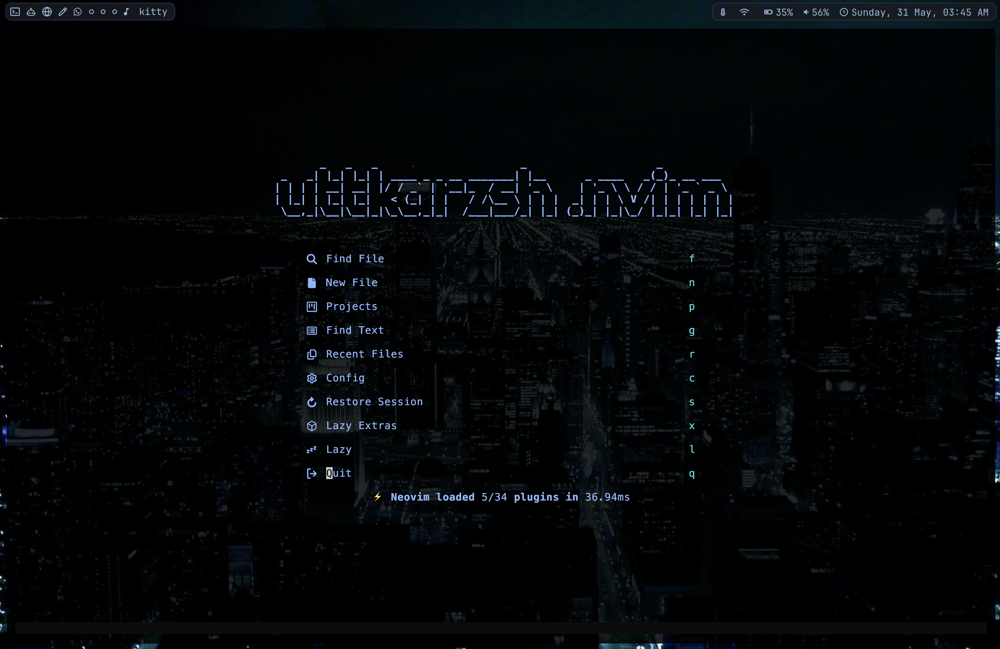

# macOS Rice

Minimal macOS setup built around a clean terminal workflow and keyboard-driven navigation.

## Preview

### Desktop

### Terminal + Neovim

## Setup

- WM: Aerospace

- Terminal: Kitty

- Editor: Neovim 

- Bar: SketchyBar [inspired from [here](https://www.reddit.com/r/unixporn/comments/1odcuyu/aerospace_i_thought_id_miss_arch/)]

- Shell: zsh

- Fetch: fastfetch

- Theme: Tokyo Night

- Font: JetBrainsMono Nerd Font
